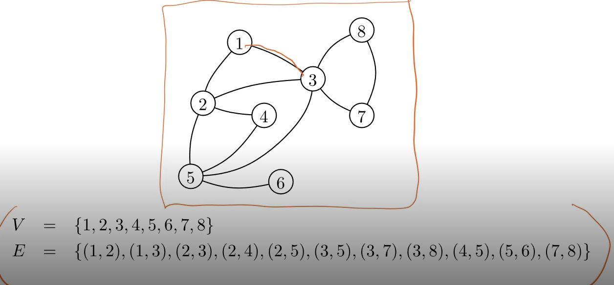

G= (V,E)

Edge와 Vertices 들로 표현함. 

Edge는 선을 연결하는 점 2개의 쌍으로 표현하고, Vertices는 하나의 점으로 표현함.

Graph는 Isomrphic하다 라는 특징이 있습니다. 이는 Edge간의 연결이 맞기만 하면, 동등하다고 봅니다.

그래프들은 컴퓨터의 문제를 쉽게 시각화 하여 나타낼 수 있음. (웹페이지 간 연결을 표현하기 쉬움.)

## Graph 알고리즘의 표현

1. Array를 이용함 

    Adjacency matrix (n by n matrix)

    행과 열은 노드 하나와 대응

    

    Symmetric 하게 표현함. Node의 연결 여부를 시간을 O(k)로 판단할 수 있음. 단점은 O($n^2$)의 공간ㅇ ㅣ필요함.

    size of graph = (n+m) (# nodes + # edges)

     $0\leq m \leq nC_2$

     graph size = $O(n)$, but Matrix size = $O(n^2)$

2. Adjacency List를 이용

     Grpah size에 Linear한 ..

     Linked List로 구성됨.

     3번 Node에 Linked List로 나타냄. 

     공간 복잡도는 O(n+m) -> Symmetric

     단점은 존재함. -> 존재 edge 존재 여부 판단하는데 있어 많은 시간이 요구됨. 

     scan or $O(min(deg(u),deg(v))), wehter (u,v) \in E$

그래프의 path는 노드의 순서로 결정함.

1235는 Path

but 17은 아님

Simple은 한 경로만 존재.

Cycle : 다시 돌아오는

Connected : 한 경로에서 연결되는 경로가 존재함.

 위 그래프는 Connected 하지않음 .

 # Tree?
Cycle이 존재하면 Tree가 아님.

Tree는 2개가 성립하면 1개는 자동으로 성립.

Tree라는 말은 unique simple path라는 것이 성립함. 만약 Unique한 Simple path가 없다면 Cycle이 존재하여 tree가 성립하지 않음.

acyclic -> cycle이 아님.

## DFS (Depth-Frist Search)

그래프 탐색 알고리즘.

여러가지 방법으로 응용 가능함. connected라면 s에서 모든 노드로 도달할 수 있음. 

방문하지 않은 노드.. 방문할 수 없는 노드가 있을 때 까지 방문함.

visited 여부를 알아야함.

현재 node (v)를 true로 시작함. vistied와 not visited를 체크해주어야함.

방문하지 않은 곳에서 recursive 하게 탐색을 시작함. 

1  -  2  - 5
ture true  true 이웃들은 살펴봄.

다음으로 방문하는 node는 6번 node.. 6번에서 갈 수 있는 곳이 없어 멈춰됨.

5번에서 시작 되는 탐색은 아직 끝난 것은 아님. 5번은 4번을 방문 -> 4번에서 탐색은 종료.

다시 5번에서 탐색이 이뤄져서 3번 노드로 탐색 됨 .
3번에서 7번 노드로 7번에서 8번 노드로 감.

이렇게 되면 모든 탐색이 종료됨.

u-v로 가는 path 가 존재하는데 발견하지 못함. 방문하지 않은 노드들이 몇가지 존재함. v와 가장가까운 node를 z라고 하면 ㄱ

z가 방문하지 않았다라고 가정해서, 거짓을 증명함. ..

도달 가능한 영역은 모두 찾을 수 있음. vetices 수와 Edge의 수의 합으로 이루어짐. (방문한 노드의 수로 결정됨. 즉 N+E)

## DFS의 응용

DFS tree에 대해서 얻을 수 있는것..

Directed grpahs >방향성이 존재함. DFS tree의 성질이 undirected와 다른 성질이 존재함.

DFS는 전체 그래프를 traversing 하는 알고리즘임. 시작점에서 

응용할 수 잇는 분야난 Connected componets를 발견할 때 사용할 수 있음.

node v, 주어진 그래프로 ..

## DFS Tree 

DFS 실행 후 추가 정보를 얻기 위해 사용함.

v가 u의 child라는 것은 explore (u) (u,v) is exmained vistied [v] =false -> v에서 탐색을 시작함.

DFS tree가 탐색으로 나온 결과에 해당함. 각 이벤트의 해당 시간을 결정 중요함.

previsit, postivist 이 값을 저장함..

Directed는 방향성이 존재함. 

Cycle이 있는지 DFS를 통해서 실행할 수 있음 . Cycle은 DFS의 Back edge를 발견할 수 있음.

## DFS Tree 2

1. Directed acylci grpah(DAG) post number가 점점 작아짐.

pre(u) < pre(v)

2. Every DAG has at least one source and at least one sink.

Source 노드는 Incoming Node가 없는 것, Sink 노드는 Outgoing 노드가 없는 것임.

노드들을 Sorting

## Convex hull 은 점집합 순서로 이루어짐.
$$
P = {p_1,p_2, \cdots ,}
$$

1. 가장 왼쪽에 있는 점을 찾음. 
2. Direct Line을 그어 왼쪽인지 오른쪽인지 판단함.

Running time
$nC_2 *n = O(n^3)$

Graham's scan 

Sorting우 left trun인지 Right turn인지 구분을 함 .

윗 부분의 Convex Line을 그림. 다음으로 아랫 부분의 Convex 를 그림.
pqr을 그으면서 결정함.
1. sorting left to right O(nlogn)
2. case 선택 O(1)
3. 점 하나 지우는 것 O(1), 스텝 이동 O(1)

nlogn + rule 1 (n-2)번 적용 + rule 2 횟수 (n-h)횟수번 발생함.

h는 convex hull의 수가 됨.

$$
$$
