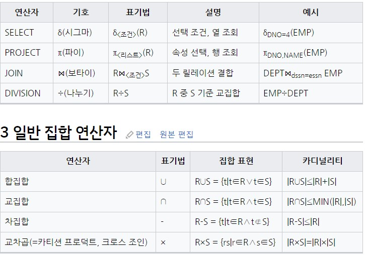
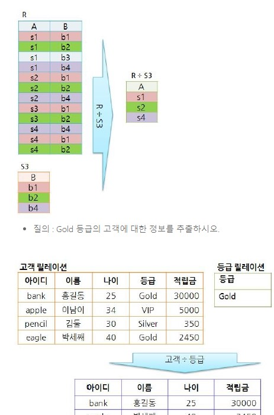
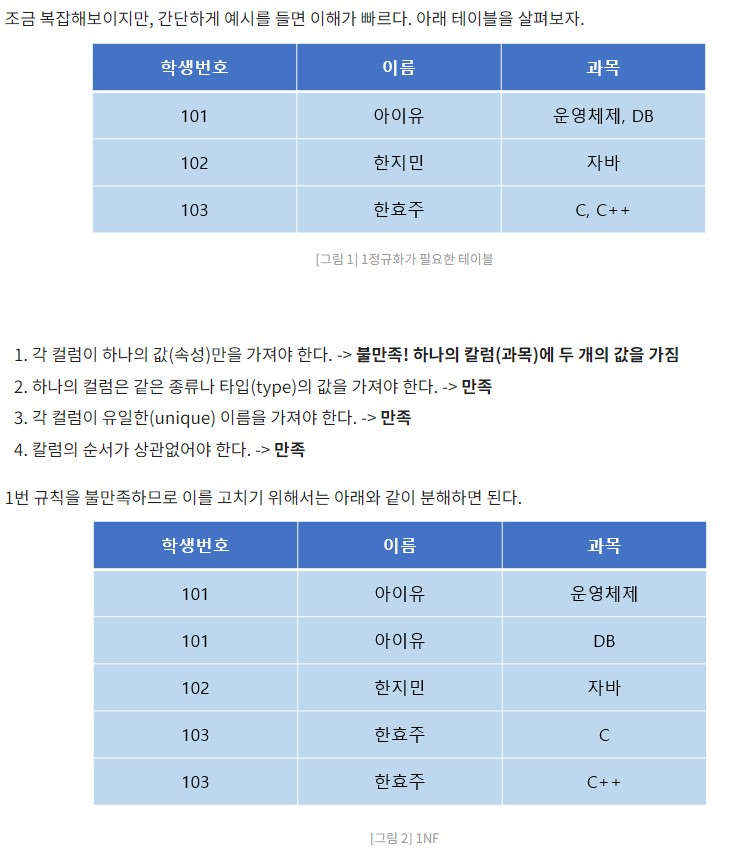
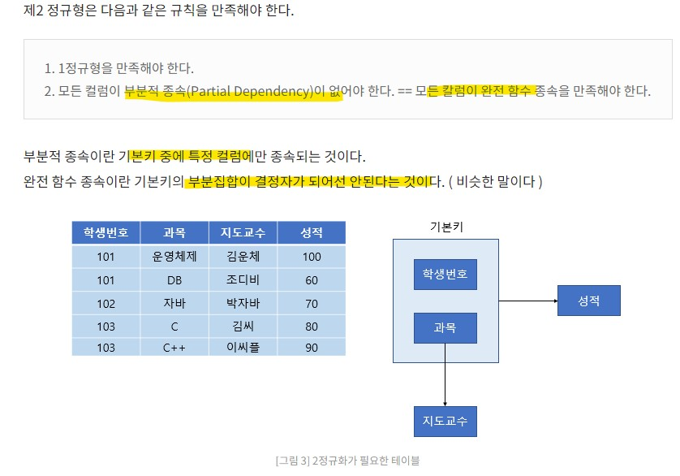
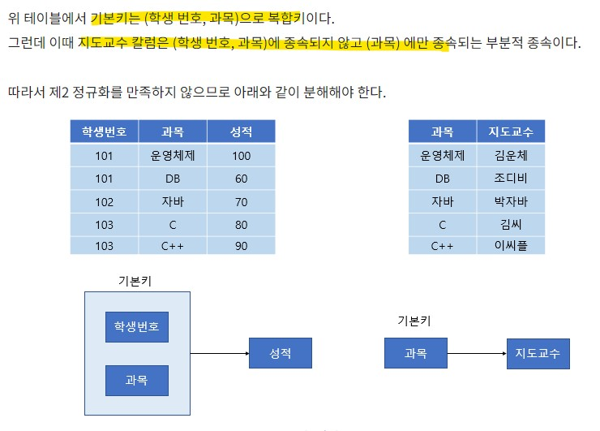
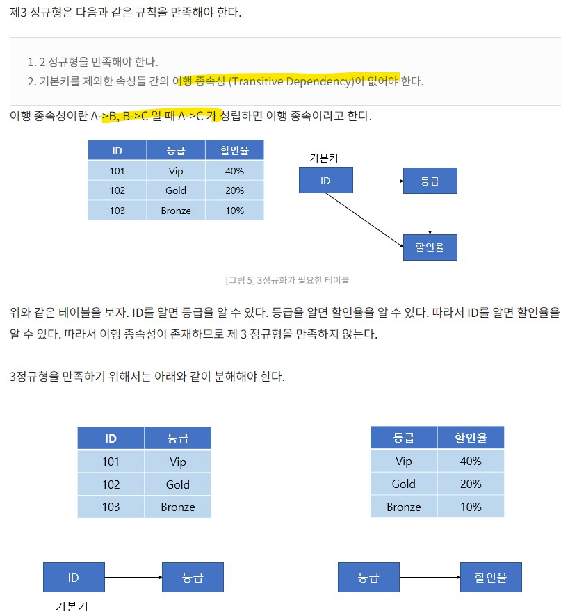
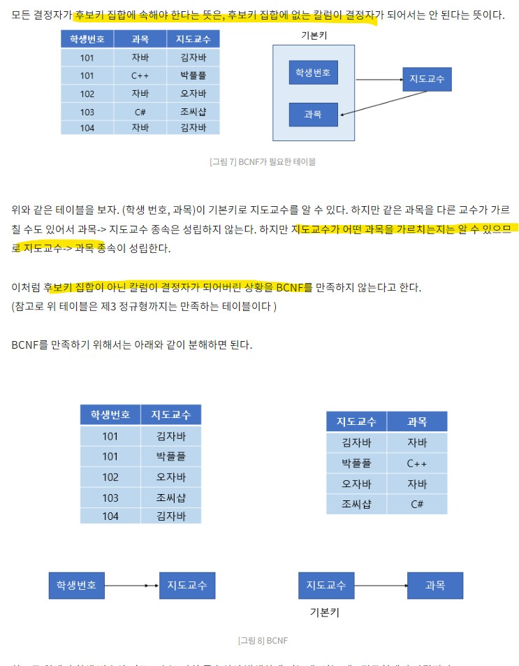

# 데이터 입출력

## (1) 데이터 전환
* ETL, Extaction Transformation, Load 추출, 변환 적재 과정
* 데이터 이관
*  정보 시스템 축적되어 있는 데이터를 추출 -> 새로 개발할 정보 시스템으로의 변환 -> 적재 과정

### 데이터 전환 계획서
* 데이터 전환에 필요한 모든 계획을 기록
  * 개요
  * 대상 범위
  * 환경 구성
  * 조직 및 역활
  * 일정
  * 방안
  * 정비 방안
  * 비상 계획
  * 복구 대책

## 데이터 검증

데이터 전환 과정이 정상 수행 되었는지 확인.

### 검증 방법에 따른 분류
|검증 방법 | 내용|
|---|---|
|로그| 전환 과정에서 작성,ETL 검증|
|기본항목| 별도 요청된 검증항목 |
|응용 프로그램 | 프로그램을 이용하여 전환 검증|
|데이터 검증 | 업무 규칙을 기준으로 데이터 전환의 정합성 검증 | 
| 값 검증 | 숫자 항목의 합계 검증, 코드 데이터 범위 검증 |

### 단계 에 따른 검증
|단계 | 목적 | 검증 방법 |
|---| ---| ---|
| 추출 | 원천 시스템 정합성 | 로그|
|전환 | 매핑 정의서 반영 확인    매핑 정의서 오류 확인 | 로그 |
|DB 적재 | 적재 중 오류 나 데이터 누락 여부 확인 | 로그
|DB 적재 후| 정합성 확인 | 기본 항목 검증 |
|완료 후 | 추가 검증 | 응용프로그램   데이터 |

## 오류 데이터 측정 및 정제

* 고품질 데이터 운영 및 관리
  
|진행 과정 | 내용 |
|---| ---|
|품질 분석 | 오류 데이터 찾기 위해 목적 시스템 데이터의 정합성 여부 확인 |
|오류 데이터 측정 | 품질 분석을 기반으로 정상 데이터와 오류 데이터의 *수*를 측정하여 오류 관리 목록을 작성 |
|데이터 정제 | 관리 목록의 각 항목을 분석하여 원천 데이터를 정의 하거나 전환 프로그램을 수정함|

* 오류 상태

|상태 | 내용 |
|---| ---|
|Open | 오류가 보고만 된상태 |
|assigned | 개발자에게 오류를 전달 한 상태 | 
|Fixed | 개발자가 오류를 수정한 상태 |
|Closed | 수정된 오류 테스트를 했을 대 오류가 발생하지 않은 상태 |
|Dereferred | 오류 수정을 연기한 상태 |
|Classified | 오류가 아니라고 확인한 상태 |

### 정제 요청서
* 정제 : 프로그램을 재 수정하는 것
* 정제와 관련된 전반적인 내용을 문서로 작성
* **오류관리 기반으로**  데이터정제 요건 목록 작성, 이 목록의 항목별로 요청서 작성

이에 따른 보고서 작성 (정제 보고서)

## 데이터 베이스 

### 데이터 저장소
* 데이터들을 논리적인 구조로 조직화, 물리적인 공간에 구축
* 논리 데이터 저장소
  * 데이터 및 데이터간의 연관성, 제약 조건을 식별하여 논리적인 구조로 조직화
* 물리 데이터 저장소
  * 논리 데이터 저장소를 소프트웨어가 운용될 환경의 물리적 특성을 고려하여 실제 저장 장치에 저장

### 데이터 모델
현실 세계의 정보를 인간과 컴퓨터가 이해할 수 있도록 추상화 하여 표현한 모델

절차 : 요구사항 분석 -> 개념적 -> 논리적 (정규화) -> 물리적 (반정규화)

#### 논리 데이터 모델
* 관계 데이터 : 1:1
* 계층 데이터 : 1:N, Tree
* 네트워크 데이터 : N:M, Graph

#### 논리 데이터 모델링 속성
* 개체
* 속성
* 관계

#### 관계 데이터 모델
* 튜플, 행, 카디널리티 (튜플 수 = 기수)
* 속성, 열, 차수 (속성 수)

#### 관계 대수

* 일반 집합 연산자 : 합집합, 교집합, 차집합, 카디션 프로덕트
* 순수 관계 연산자 :
  * 셀렉트($\sigma$) : R에서 조건을 만족하는
  * 프로젝트($\Pi$) : R에서 주어진 속성들의 값으로만 구성
  * 조인(): 공통 속성이용
  * 디비전 () : S의 모든 튜플과 관련 있는 R의 튜플 변환

https://itwiki.kr/w/%EA%B4%80%EA%B3%84%EB%8C%80%EC%88%98

#### 관계 해석

튜플 관계 해석과 도메인 관계해석하는 비 절차적 언어
#### ER 모델
데이터와 그들간의 관꼐를 사람이 이해할 수 있는 형태로 표현

#### 정규화 
데이터의 중복성을 제거해 이상현상을 방지, 데이터의 일관성! 과 정확성!을 유지하기 위해 무손실 분해

* 1NF : 도메인이 원자 값

* 2NF : 부분함수 종속 제거

* 3NF : 이행함수 종속 제거 (A->B, B->C 이면 A->C)

* BCNF : 결정자 후보키가 아닌 함수 종속 제거

* 4NF : 다치(다중 값) 종속 제거
* 5nf : 조인 종속 제거
  

#### 이상현상
데이터 중복성으로 인해 릴레이션을 조작할때 발생하는 비합리적인 현상
* 삽입, 삭제, 갱신

#### 반정규화 (DeNormalization)

정규화 된 엔티티, 속성, 관계에 대해 성능 향상과 개발 운영의 단순화를 위해 중복, 통합, 분리 등을 수행하는 과정

#### 참조무결성 제약조건

참조하는 외래키의 값은 항상 참조되는 릴레이션에 기본키로 존재해야한다.

* 제한(RESTRICT), 연쇄(CASCADE), 널 값(SET NULL)

인덱스

전체 데이터 검색 없이 필요한 정보에 대해 신속한 조회 가능

뷰

접근이 허용된 자료만을 제한적으로 보여주기 위해 하나 이상의 기본 테이블로 구성된 가상 테이블

클러스터

데이터 액세스 효율을 향상시키기 위해 동일한 성격의 데이터를 동일한 데이터 블록에 저장하는 물리적 저장 방법

파티션(Partition)의 종류

* 레인지(Range) 파티셔닝 : 연속적인 숫자나 날짜 기준
* 해시(Hash) 파티셔닝 : 파티션 키의 해시 함수 값
* 리스트(List) 파티셔닝 : 특정 파티션에 저장 될 데이터에 대한 명시적 제어 가능
* 컴포지트(Composite) 파티셔닝 : 레인지, 해시, 리스트 중 2개 이상의 파티셔닝 결합

DBMS

데이터 관리의 복잡성을 해결하는 동시에 데이터 추가, 변경, 검색, 삭제 및 백업, 복구 보안 등의 기능을 지원하는 SW

DBMS 유형

키-값 DBMS
컬럼 기반 데이터 저장(Column Family Data Store)
문서 저장(Document Store)
그래프(Graph Store) : 시맨틱 웹과 온톨로지 분야

시맨틱 웹(Semantic Web)

기계가 이해할 수 있는 온톨로지 형태로 표현하고 자동화된 기계가 처리하도록 하는 지능형 웹

온톨로지(Ontology)

실세계에 존재하는 모든 개념들과 개념들의 속성, 개념들 간의 관계 정보를 컴퓨터가 이해할 수 있도록 서술해 놓은 지식베이스
데이터 마이닝 주요기법

분류 규칙(Classification) : 과거 데이터로부터 특성을 찾아내어 분류모형을 만들어 결과 값 예측
연관 규칙(Association) : 데이터 안에 존재하는 항목들 간의 종속관계를 찾아내는 기법
연속 규칙(Sequence) : 연관 규칙에 시간 관련 정보가 포함된 형태의 기법
데이터 군집화(Clustering) : 대상 레코드들을 유사한 특성을 지는 몇 개의 소그룹으로 분할하는 작업